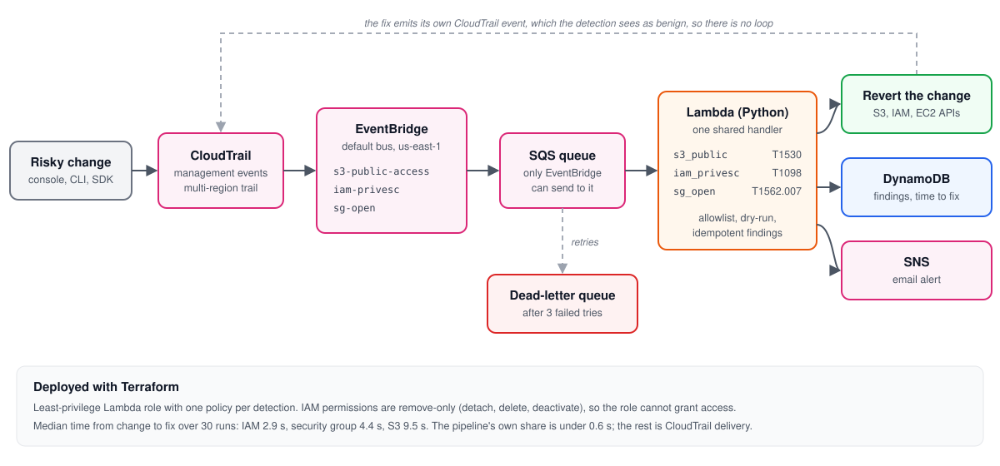

# AWS Detection and Auto-Remediation Pipeline

This project watches an AWS account for three kinds of risky configuration change and undoes them automatically. If someone makes an S3 bucket public, grants a user admin rights, or opens SSH or RDP on a security group to the whole internet, the pipeline picks up the CloudTrail event, reverts the change, records a finding mapped to MITRE ATT&CK, and emails an alert.

Across 30 timed runs, the median time from the change to the fix was 2.9 seconds for IAM privilege escalation, 4.4 seconds for security groups, and 9.5 seconds for S3. The pipeline's own code accounts for less than 0.6 seconds of that. Almost all of the rest is CloudTrail delivering the event.

Everything is deployed with Terraform and can be torn down with a single `terraform destroy`.



## How it works

Every API call in the account lands in CloudTrail. EventBridge has one rule per detection that matches the API calls that detection cares about, and each rule drops matching events into an SQS queue. A Python Lambda reads from the queue, runs the event through the matching detection, and decides what to do.

If the change is risky, the Lambda reverts it with a single API call, writes a finding to DynamoDB, and publishes an alert to SNS. If it's benign, it logs that and moves on. If processing fails three times, the message moves to a dead-letter queue instead of vanishing.

The finding records who made the change, from which IP, what resource was affected, which ATT&CK technique it maps to, what was done about it, and how many seconds the fix took. That last number comes from comparing CloudTrail's `eventTime` with the moment the remediation call returned.

All of it runs in us-east-1. That choice is deliberate. IAM is a global service, and its CloudTrail events are only delivered to us-east-1, so an EventBridge rule in any other region would never see an IAM change.

## Detections

| Detection | Triggering API calls | What the fix does | ATT&CK |
|---|---|---|---|
| S3 bucket made public | `PutBucketPolicy`, `PutBucketAcl`, `DeleteBucketPublicAccessBlock`, `PutBucketPublicAccessBlock` | Re-applies all four Block Public Access settings | T1530 |
| IAM privilege escalation | `Attach*Policy`, `Put*Policy`, `AddUserToGroup`, `CreateAccessKey` | Detaches, deletes, removes, or deactivates, depending on the change | T1098.003, T1098.001 |
| Security group open to the internet | `AuthorizeSecurityGroupIngress` | Revokes the specific rule that was added | T1562.007 |

### S3 bucket made public

A bucket counts as public if a policy statement allows `Principal: *` with no conditions, if an ACL grants access to `AllUsers` or `AuthenticatedUsers`, or if its Block Public Access settings are deleted or any of them are turned off.

One remediation covers all four triggers. Turning Block Public Access back on doesn't delete the offending policy or ACL, it makes them ineffective. That means nothing the bucket owner configured gets destroyed, and they can review it later.

A wildcard principal with a condition, such as `aws:PrincipalOrgID`, isn't flagged. That pattern is how organizations share buckets internally, and flagging it would break legitimate setups.

### IAM privilege escalation

This one catches four ways of quietly handing out admin access. Attaching `AdministratorAccess` or `IAMFullAccess` to a user, role, or group gets detached. An inline policy that allows `*` or `iam:*` on every resource gets deleted, and a full copy of the policy is saved in the finding first, since inline policies can't be disabled. Adding a user to a group gets reverted only if the group itself is effectively admin. Creating an access key for a different user gets the key deactivated.

The group case is the only one that can't be judged from the event alone, because the event says who joined which group but not what the group grants. The detection makes one extra API call to check before acting.

Access keys are deactivated rather than deleted. It's reversible if the key turns out to be legitimate, and the key stays around so its activity can be looked up in CloudTrail during an investigation.

### Security group open to the internet

A rule is flagged when it allows 0.0.0.0/0 or ::/0 on port 22 or 3389. That includes rules that cover those ports without naming them, like an all-traffic rule or a port range of 0 to 65535. HTTPS open to the world is normal for a web server and is left alone.

The fix revokes only the rule that was added, using the rule ID AWS returns in the CloudTrail response. If someone opens SSH and HTTPS in the same request, SSH gets revoked and HTTPS stays.

## Results

Each detection was triggered 10 times with `scripts/benchmark.py`, which cycles through the different attack variants and then reads the recorded times back from DynamoDB.

| Detection | Median | p90 | Worst | Delivery (AWS) | Handling (pipeline) |
|---|---|---|---|---|---|
| IAM privilege escalation | 2.88 s | 4.11 s | 4.64 s | 2.80 s | 0.08 s |
| Security group open to the internet | 4.40 s | 6.15 s | 6.28 s | 3.46 s | 0.55 s |
| S3 bucket made public | 9.54 s | 11.23 s | 12.03 s | 8.76 s | 0.26 s |

All 30 runs were remediated. Delivery is the time from the CloudTrail event to the Lambda starting on it, and handling is the Lambda's own work, including the remediation call. The gap between services comes almost entirely from how quickly each one delivers events to EventBridge. S3 is consistently the slowest. Security group handling is a little higher than the others because it makes two EC2 API calls.

CloudTrail truncates `eventTime` to whole seconds, so every number here carries roughly a second of uncertainty. The raw output is in [docs/benchmark-results.md](docs/benchmark-results.md).

## Design decisions

### Why SQS sits between EventBridge and Lambda

EventBridge can invoke a Lambda directly. By default, though, a failed invocation is retried a couple of times and then dropped, unless you add a failure destination on top. With a queue in the middle, every event is held until it has been processed successfully, and after three failures it moves to a dead-letter queue where someone can look at it. The Lambda reports failures per message, so one bad event doesn't force a whole batch to retry.

The queue also absorbs bursts. A single `terraform apply` can produce hundreds of events at once, and SQS lets the Lambda work through them at its own pace instead of hitting concurrency limits. For a security control, silently losing an event is the worst possible outcome, so the extra piece is worth it.

### Why auto-remediate instead of just alerting

A public bucket or an open SSH port is exposed from the moment it's created. An alert that sits in an inbox until morning leaves it open for hours, while this closes it within seconds. The trade-off is the risk of reverting something legitimate, which is what the allowlist and dry-run mode are for.

In a real organization, I'd start with `dry_run = true`, let it run in detect-only mode for a week or two, review every finding, tune the allowlist, and only then turn remediation on. A security tool that breaks production on its first day doesn't get a second chance.

### Keeping false positives down

Resources that are supposed to be open can be tagged to opt out. The tags are `detlab:allow-public` for S3 buckets, `detlab:allow-privileged` for IAM users and roles, and `detlab:allow-public-ingress` for security groups. Allowlisted changes are still recorded as findings, they just aren't reverted.

API calls that failed, for example because they were denied, are skipped entirely, since nothing actually changed. If the Lambda can't read a resource's tags for any reason other than "there are none," it treats the resource as not allowlisted. When in doubt, it fixes.

### Making the remediation role safe

The Lambda's role has one IAM policy per detection, each scoped to the handful of actions that detection needs. The IAM permissions are all remove-only (detach, delete, deactivate, remove from group). If the function were ever compromised, the worst an attacker could do is take access away. They could never grant it.

Because the Lambda acts on whatever arrives in the queue, a forged "AdministratorAccess was attached to role X" message could trick it into stripping a real admin's access. The queue policy blocks this with an explicit Deny on `sqs:SendMessage` for anyone except the three EventBridge rules. Even an admin user gets `AccessDenied` when trying to send to it, because an explicit Deny in a resource policy overrides any Allow.

### No remediation loops

When the Lambda re-applies Block Public Access, that produces its own `PutBucketPublicAccessBlock` event, which comes back through the pipeline. The S3 detection sees all four settings are on and logs it as benign. The IAM and EC2 fixes use API calls that none of the rules match, so they never come back at all.

### Duplicate events

SQS guarantees at-least-once delivery, so the same event can occasionally arrive twice. Each finding's ID is built from the CloudTrail event ID, and the DynamoDB write is conditional. A duplicate can't create a second finding or a second email, but a retry can still overwrite a finding that previously failed.

## Deploy it yourself

You'll need an AWS account you're comfortable experimenting in, the AWS CLI, Terraform 1.6 or newer, and Python 3.11 or newer. Use an account with nothing important in it, because the pipeline will revert matching changes to any resource in us-east-1.

```bash
git clone https://github.com/dhruvvv55/aws-detection-pipeline.git
cd aws-detection-pipeline/terraform
cp terraform.tfvars.example terraform.tfvars   # set alert_email
terraform init
terraform apply
```

AWS will email a subscription confirmation after the apply. Alerts won't arrive until you click the link. To run in detect-only mode, deploy with `terraform apply -var dry_run=true`.

The unit tests don't touch AWS. Run them from the repo root.

```bash
python3 -m venv .venv && source .venv/bin/activate
pip install -r requirements-dev.txt
pytest
```

Each detection has a simulation script that creates a throwaway resource, triggers the detection, waits for the fix, and cleans up after itself. The IAM user it creates has no password or console access, and the security group has nothing attached, so nothing is actually exposed.

```bash
./scripts/simulate_s3_public.sh            # also: policy, allowlist
./scripts/simulate_iam_privesc.sh          # also: inline, key, group, allowlist
./scripts/simulate_sg_open.sh              # also: rdp, all, benign, allowlist
python3 scripts/benchmark.py               # 10 timed runs per detection
```

The S3 `policy` mode only works if account-level Block Public Access is off. With it on, which is the right setting for any real account, the default mode still exercises the full pipeline.

Running this costs a few cents a month. The Terraform includes a $5 monthly budget alert. To remove everything, run `terraform destroy` from the `terraform/` folder.

## Limitations and what I'd add next

It only watches us-east-1. IAM is covered everywhere because its events are global, but S3 and EC2 changes in other regions are invisible. The fix would be an EventBridge rule in each region that forwards matching events to the us-east-1 bus. The Lambda already creates its EC2 client in the event's region, so remediation would work without code changes.

The security group check only matches exact 0.0.0.0/0 and ::/0, so a range like 0.0.0.0/1 would get past it. It also doesn't watch `ModifySecurityGroupRules`, which can edit an existing rule to open it up.

The IAM detection covers the most common escalation paths but not all of them. `CreatePolicyVersion`, `UpdateAssumeRolePolicy`, `CreateLoginProfile`, and `iam:PassRole` abuse are all known routes to admin that it doesn't catch yet.

Failed attempts are skipped because nothing changed. Someone repeatedly trying to make buckets public and getting denied is still worth knowing about, so I'd like to alert on those without remediating.

It's built for a single account. In an AWS Organization, I'd use an organization trail, send events from every member account to a central event bus in a security account, and have the Lambda assume a remediation role in each member account. That role would be deployed everywhere through CloudFormation StackSets, with the same remove-only permissions. The detection code wouldn't need to change.

Next on the list are two more detections. The first catches CloudTrail being stopped or deleted, which is an attacker trying to blind the very system that would catch them. The second alerts on any use of the root account. I also want to forward findings to Splunk over HTTP Event Collector, which would bring this in line with my [GCP detection lab](https://github.com/dhruvvv55/cloud-threat-detection-lab).

## Repo layout

```
lambda/
  src/
    handler.py              shared entry point: skip, detect, remediate, record, alert
    detections/             one module per detection
  tests/                    60 pytest tests, plus sanitized CloudTrail fixtures
scripts/
  simulate_*.sh             trigger each detection safely
  benchmark.py              timed runs and summary stats
  sanitize_fixture.py       scrubs account IDs, IPs, and key IDs from fixtures
terraform/                  everything that gets deployed
docs/                       architecture diagram and benchmark results
```
